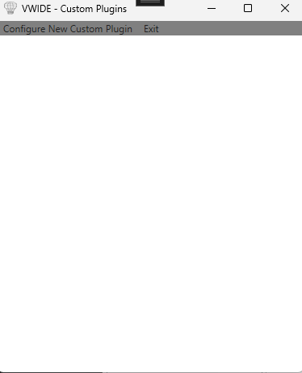
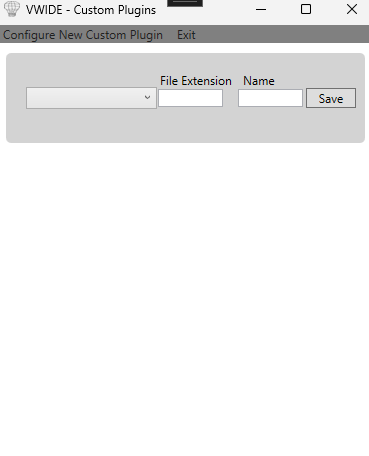
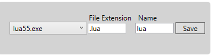

# Custom Plugin Installation
## Quick Note

## DLL Custom Plugins
As of the current version (0.9.0.0) the code template for making custom dll is not finalised and thus not released, Any DLL plugins outside of the officially created ones may potentially be harmful and thus may be dangerous to download.

## What this guide is for
This guide aims to demonstrate how to allow VwIDE to execute unsupported languages in a limited capacity. ***It is impossible to guarantee full 100% support of these languages with zero issues*** this feature is simply able to bridge gaps should a certain language be required.  

## Guide to installation
In order to install and create custom plugins you will need to first download and find the language binary file (This is usually a .exe file)

Extract the folder into `VWIDE\Binaries\Custom Binaries`. 

Once this is complete go into VwIDE `Binaries -> Configure Custom Plugins` and you will see the following window:

Click on `Configure New Custom Plugin`

It shall bring up the following:

In here You will perform the following actions:
* The drop down menu - Select the exe file that corresponds to the language binary
* File Extension - Enter the file extension that the language uses
* Name - What you wish for the plugin to be called

In the image below is an example of a complete configuration:

Click save and then you are done!

This will create a .txt file inside the `Custom Plugin Folder` which routes the information needed for execution, to uninstall the custom plugin simply click the Delete button that appears above save.