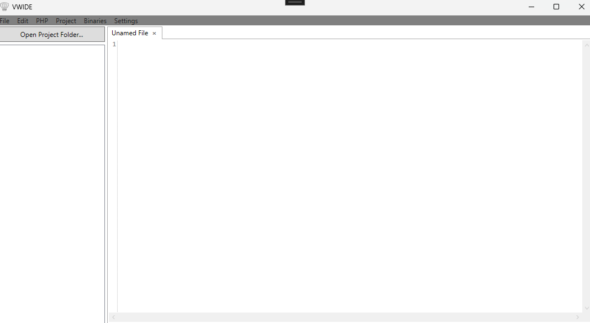
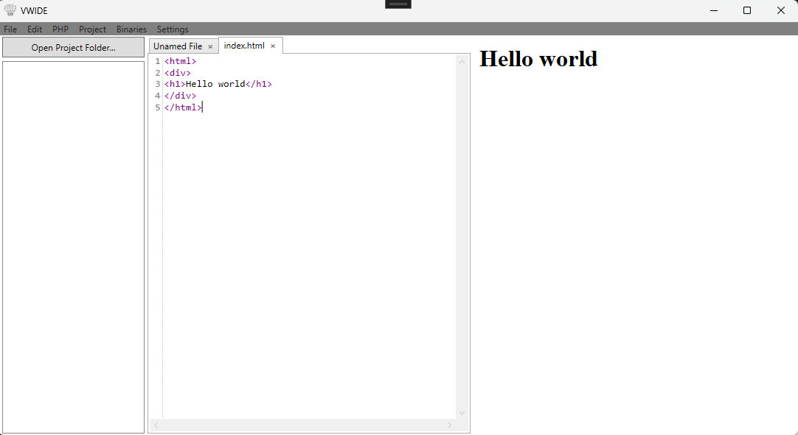
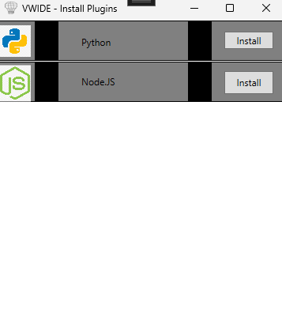

# VwIDE

## Introduction - What is VwIDE?
VwIDE stands for **Visual Web IDE (Integrated Development Environment)**. The software aims to be a lightweight web coding environment with a built-in Chromium engine (provided by the Microsoft.Web.WebView2 package). This software streamlines your web development workflow so you don't have to jump between several different windows just to test one web page!

## Using the VwIDE Software

### Getting Started
The software does not require an installer—simply download the latest release from GitHub and extract the ZIP folder to get started.

As seen in the screenshot above, this is the UI of VwIDE. VwIDE offers many different functions. It opens by default on an unnamed file with the webview disabled. By clicking `File -> Open` and selecting an `.html` file, it will open the file and bring up the webview!

The webview on the right will update as you type into the text editor on the left. The **File** menu also has options for saving, saving as, and creating a new file.

The **Edit** menu has several utility functions, including:
* Undo
* Redo
* Cut
* Copy
* Paste
* Find and Replace
* Refresh
* Clear Cache and Refresh

### PHP and Project Folders
With the **PHP** button, you can enable and disable PHP. This allows you to render and operate on PHP files, as well as open a project directory!

By clicking the **Open Project Folder...** button, you can select a folder to open and gain a file tree view to open files from. You can click `Project -> Clear Project Directory` to clear the file tree view. Having a project folder open allows images and scripts within the same folder to be correctly referenced and rendered in your web page.

### Settings
The **Settings** tab holds several quality-of-life features to make using VwIDE as easy as possible, including:
* Enable/Disable Dark Mode
* Setting Font Size
* Enabling PHP by Default
* Enabling Dark Mode by Default
* Setting the Current Project Directory as the Default
* Saving Changed Settings

### Binaries and Plugins
Finally, there is the **Binaries** tab, which has two options:
1. Install Plugins
2. Configure Custom Plugins

> *For instructions on configuring custom plugins, see `Custom Plugin Creation instructions.md`.*

Clicking on **Install Plugins** takes you to the following window:

In this window, you can install plugins for supported libraries or languages (as of the current version, Python and Node.js are supported). Installing and uninstalling these plugins is as simple as pressing the button!

## Support, Maintaining, and Development
VwIDE was developed by myself (ZCpU05) and will continue to be maintained with bug fixes and additional features for the foreseeable future. Should any issues or bugs arise, please report them by creating a GitHub issue on the repository. 